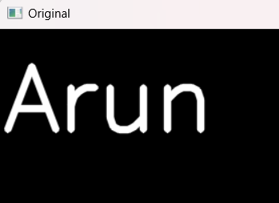
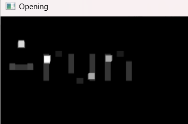

# OPENING--AND-CLOSING
## Aim
To implement Opening and Closing using Python and OpenCV.

## Software Required
1. Anaconda - Python 3.7
2. OpenCV
## Algorithm:
### Step1:

Load the input image using cv2.imread().

### Step2:

Define a structuring element (e.g., 5x5 rectangular) using cv2.getStructuringElement().


### Step3:

Perform erosion followed by dilation using cv2.morphologyEx() with the cv2.MORPH_OPEN operation.


### Step4:

Perform dilation followed by erosion using cv2.morphologyEx() with the cv2.MORPH_CLOSE operation.


### Step5:

Use plt.subplot() to show the original, opening, and closing images side by side.


 
## Program:
# NAME : ARUN KUMAR B
# RES.NO : 212223230021

``` Python
import cv2
import numpy as np
import matplotlib.pyplot as plt

img1=np.zeros((300,600),dtype='uint8')
font=cv2.FONT_ITALIC
img2=cv2.putText(img1,"sai",(5,100),font,3,(255,0,0),5,cv2.LINE_AA)
cv2.imshow("Original",img2)
cv2.waitKey(0)
cv2.destroyAllWindows()

#kernel1=cv2.getStructuringElement(cv2.MORPH_RECT,(21,21))
#kernel2=cv2.getStructuringElement(cv2.MORPH_RECT,(9,9))
kernel1=cv2.getStructuringElement(cv2.MORPH_RECT,(21,21))
kernel2=cv2.getStructuringElement(cv2.MORPH_RECT,(9,9))

img4=cv2.morphologyEx(img1,cv2.MORPH_OPEN,kernel2)
cv2.imshow("Opening",img4)
cv2.waitKey(0)
cv2.destroyAllWindows()

img3=cv2.morphologyEx(img1,cv2.MORPH_CLOSE,kernel1)
cv2.imshow("Closing",img3)
cv2.waitKey(0)
cv2.destroyAllWindows()
```
## Output:

### Display the input Image




### Display the result of Opening

### Display the result of Closing


## Result
Thus the Opening and Closing operation is used in the image using python and OpenCV.
